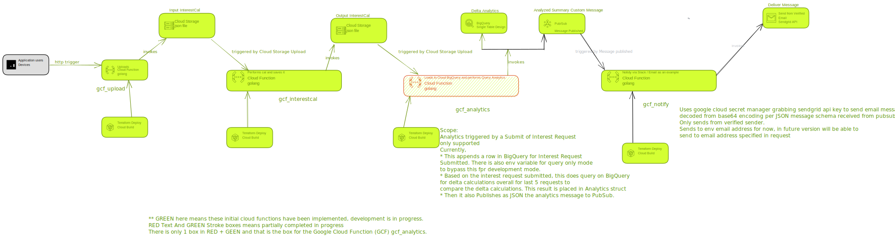

# Illuminating Deposits - Google Cloud Platform (GCP) trigger of Resources applied to Golang (Go) Google Cloud Functions (GCF 2nd Generation)

### What is **Delta** in the context of this project?

**Delta** is the approx. value of 30 days Interest for a deposit. So if a deposit is for 10 years the Delta
is still calculated for 30 days Interest using the Interest for 10 years to get an approx. value of 30 days Interest.
Hence, the variation in interest money in 30 days is called Delta. This value Delta is used to compare as a mechanism to
let you know which deposits are performing better for you.

(Development is WIP)

Illuminating Deposits Project Logo: 

## Overall google cloud architecture system design:

Created from link:

[Google Cloud Architecture](https://googlecloudcheatsheet.withgoogle.com/architecture)

GREEN here means these initial cloud functions have been implemented, development is in progress.
RED Text And GREEN Stroke boxes means partially completed in progress
There is only 1 box in RED + GEEN and that is the box for the Google Cloud Function (GCF) gcf_analytics. 

**---------------------------**
## Cloud Function Deploy: gcf_upload
gcf_upload google cloud function is triggered by HTTP request and submits HTTP POST request body to
google cloud storage bucket for further processing.

Terraform is used to deploy gcf_upload to google cloud.
The service account used for deployment needs keys to be generated and stored in the deploy/terraform folder
with the file being renamed to keys.json.
The gcf_upload is written in Go and uses google cloud storage and google cloud functions.

### Make steps for gcf_upload deployment in cloud:
Add alias tf=terraform in .zshrc or equivalent
Steps start from root of project folder
1. `cd gcf_upload`
2. `make init`
3. `make apply`
In the end on successful creation you will get something like:
`google_cloudfunctions2_function.illuminating_gcf_upload: Creation complete`
4. Dependent Google cloud functions should be destroyed first. So if you are also working on
gcf_interestcal also for example (see below) then see destruction in gcf_interestcal.
If you are only playing around with this Google cloud function,
after you are done using this function and no longer need for any processing, `make destroy`
In the end on successful destruction you will get something like:
`google_storage_bucket.illuminating_gcf_upload_bucket: Destruction complete`
Also, See Related [Multiple Cloud Functions](#multiple-cloud-functions)

#### Testing gcf_upload in cloud:
1. `make cloud-incorrect-json`
2. `make cloud-not-successful-http-request-accounttypemissing`
3. `make cloud-not-successful-http-request-banknamemissing`
4. `make cloud-successful-http-request`

### Make steps for gcf_upload deployment locally:
Steps start from root of project folder
1. `cd gcf_upload`
2. `make gcf-local`

#### Testing gcf_upload locally:
1. `cd gcf_upload`
2. `make local-incorrect-json`
3. `make local-not-successful-http-request-accounttypemissing`
4. `make local-not-successful-http-request-banknamemissing`
5. `make local-successful-http-request`
Here this sends Cloud Storage event to a CloudEvent function running at localhost:8080 using curl request.

### Seeing logs in console on the web for a cloud function:
1. Go to Log tab of Google Cloud Function
2. Click Log Explorer
3. At the bottom Click Edit Time to see logs for the last 15 minutes 
(even this can be edited to say last 10 minutes)
Per the retention period these logs delete after 30 days. There is no charge for the 30-day period.
([https://cloud.google.com/logging#section-7](https://storage.cloud.google.com/illuminating_upload_json_bucket/inputrequest.json))
4. Click Refresh button to see the logs
Also, See Related [Multiple Cloud Functions](#multiple-cloud-functions)

To see logs using gcloud command line:
* `gcloud config set project illuminatingdeposits-gcp`
* `gcloud auth login `
* `sudo pip3 install grpcio`
* `export CLOUDSDK_PYTHON_SITEPACKAGES=1`
* `gcloud alpha logging tail --format="default(timestamp,text_payload)"`

**---------------------------**

## Cloud Function Deploy: gcf_interestcal
gcf_interestcal google cloud function is triggered by upload to illuminating_upload_json_bucket_input by gcf_upload cloud
function and starts calculating Delta for each bank account including overall for all deposits. It then also
uploads the calculated  Deltas with deposit details to illuminating_upload_json_bucket_output google cloud storage bucket
for further processing.

Depends on gcf_upload cloud function deployed and having run successfully. See System Diagram for more details.

Terraform is used to deploy gcf_interestcsal to google cloud.
The service account used for deployment needs keys to be generated and stored in the deploy/terraform folder
with the file being renamed to keys.json.
The gcf_interest is written in Go and uses google cloud storage and google cloud functions.

### Make steps for gcf_interestcal deployment in cloud:
Add alias tf=terraform in .zshrc or equivalent
Steps start from root of project folder
1. `cd gcf_interestcal`
2. `make init`
3. `make apply`
   In the end on successful creation you will get something like:
   `google_cloudfunctions2_function.illuminating_gcf_interestcal: Creation complete`
4. After you are done using this function and no longer need for any processing, `make destroy`
   In the end on successful destruction you will get something like:
   `google_storage_bucket.illuminating_gcf_interestcal_bucket: Destruction complete`
Also, See Related [Multiple Cloud Functions](#multiple-cloud-functions)

#### Testing gcf_interestcal in cloud:
`make cloud-successful-storage-upload`
This copies the file locally to cloud storage

### Make steps for gcf_interestcal deployment locally:
Steps start from root of project folder
1. `cd gcf_interestcal`
2. `make gcf-local`

#### Testing gcf_interestcal locally:
`make local-successful-send-event-to-cloud-event-function`
This only triggers the function locally and does not copy the file to cloud storage.
Here this sends Cloud Storage event to a CloudEvent function running at localhost:8080 using curl request.

**---------------------------**

## Cloud Function Deploy: gcf_analytics
gcf_analytics google cloud function is triggered by upload to illuminating_upload_json_bucket_output by gcf_interestcal cloud
function and starts appending the calculations to BigQuery `delta_calculations` table in `gcfdeltaanalytics` table.
Scope: Analytics triggered by a Submit of Interest Request only supported currently.
Currently, 
* This appends a row in BigQuery for Interest Request Submitted. There is also env variable for query only mode to bypass this fpr development mode.
* Based on the interest request submitted, this does query on BigQuery for delta calculations overall for last 5 requests to
compare the delta calculations. This result is placed in Analytics struct 
* Then it also Publishes as JSON the analytics message to PubSub.

Depends on gcf_interestcal cloud function deployed and having run successfully. See System Diagram for more details.

### Make steps for gcf_analytics deployment in cloud:
Add alias tf=terraform in .zshrc or equivalent
Steps start from root of project folder
1. `cd gcf_analytics`
2. `make init`
3. `make apply`
4.  In the end on successful creation you will get something like:
    `google_cloudfunctions2_function.illuminating_gcf_analytics: Creation complete`
5. After you are done using this function and no longer need for any processing, `make destroy`
   In the end on successful destruction you will get something like:
   `google_storage_bucket.illuminating_gcf_analytics_bucket: Destruction complete`
Also, See Related [Multiple Cloud Functions](#multiple-cloud-functions)

#### Testing gcf_analytics in cloud:
`make cloud-successful-storage-upload`
This copies the file locally to cloud storage

### Make steps for gcf_analytics deployment locally:
Steps start from root of project folder
1. `cd gcf_analytics`
2. `make gcf-local`

#### Testing gcf_analytics locally:
`make local-successful-send-event-to-cloud-event-function`
This only triggers the function locally and does not copy the file to cloud storage.
You can send an event to CloudEvent function locally with already existing file in cloud storage
Here this sends Cloud Storage event to a CloudEvent function running at localhost:8080 using curl request.

## Cloud Function Deploy: gcf_notify
This Google cloud function is triggered by message published to pubsub topic `deltaanalyticstopic` by
gcf_analytics cloud function. Uses google cloud secret manager grabbing sendgrid api key to send email message
decoded from base64 encoding per JSON message schema received from pubsub.
Only sends from verified sender.
Sends to env email address for now, in future version will be able to
send to email address specified in request

Depends on gcf_analytics cloud function deployed and having run successfully. See System Diagram for more details.

### Make steps for gcf_notify deployment in cloud:
Add alias tf=terraform in .zshrc or equivalent
Steps start from root of project folder
1. `cd gcf_notify`
2. `make init`
3. `make apply`
4.  In the end on successful creation you will get something like:
    `google_cloudfunctions2_function.illuminating_gcf_notify: Creation complete`
5. After you are done using this function and no longer need for any processing, `make destroy`
   In the end on successful destruction you will get something like:
   `google_storage_bucket.illuminating_gcf_notify_bucket: Destruction complete`
   Also, See Related [Multiple Cloud Functions](#multiple-cloud-functions)

#### Testing gcf_notify in cloud:
`make cloud-pubsub-message-successful`
This publishes a message to pubsub topic

### Make steps for gcf_notify deployment locally:
Steps start from root of project folder
1. `cd gcf_notify`
2. `make gcf-local`

#### Testing gcf_notify locally:
`make local-successful-send-event-to-cloud-event-function`
This triggers the function locally by sending message to deltaanalyticstopic.
Here this sends Cloud Pub/Sub event to a CloudEvent function running at localhost:8080 using curl request.

**---------------------------**

## Multiple Cloud Functions 

### Multiple Cloud Functions Deploy: gcf_upload and gcf_interestcal and gcf_analytics
Add alias tf=terraform in .zshrc or equivalent
Steps start from root of project folder at `illuminatingdeposits-gcp-trigger`

1. `make init`
2. `make apply`
3. `make destroy`

#### Integration Testing gcf_upload, gcf_interestcal, gcf_analytics and gcf_notify in cloud:
Since everything gets triggered with gcf_upload, we will test gcf_upload , gcf_interestcal, gcf_analytics and gcf_notify together using gcf_upload http request submission:
1. `cd gcf_upload`
2. `make cloud-successful-http-request`
3. To view logs in Google Cloud [Log Explorer](https://console.cloud.google.com/logs/) for all cloud functions change query tab text to:
  `(resource.type = "cloud_run_revision"
   resource.labels.service_name ="illuminating-gcf-upload" OR resource.labels.service_name = "illuminating-gcf-interestcal" OR resource.labels.service_name = "illuminating-gcf-analytics" OR resource.labels.service_name = "illuminating-gcf-notify"
   resource.labels.location = "us-central1")
   severity>=DEFAULT`
4. Click Run Query
5. Adjust time to see logs from last 10 minutes or whatever as needed
6. You should see in log email sent. This happens after the analytics are calculated and sent to pubsub topic.
7. you should receive an email set in env variable `RECEIVER_EMAIL` in gcf_notify cloud function with the custom message.

**---------------------------**

# Version
v0.5.0
